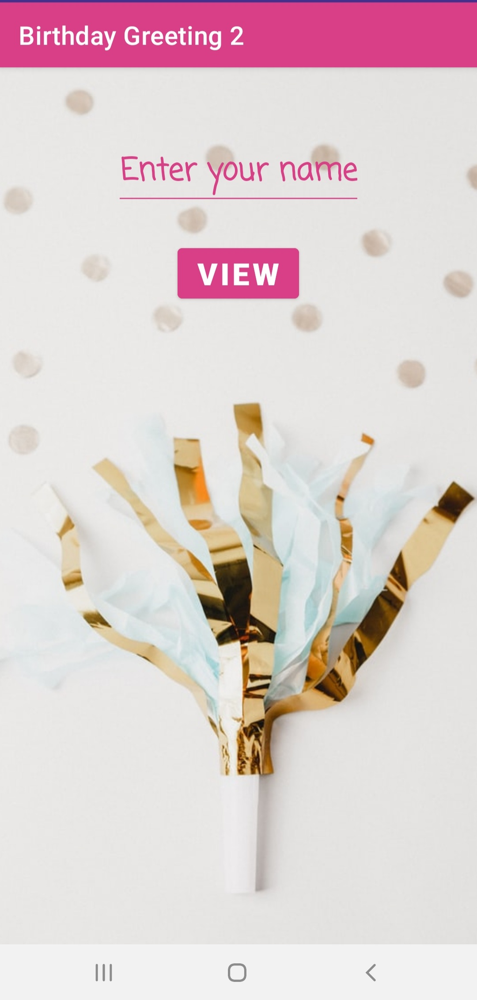
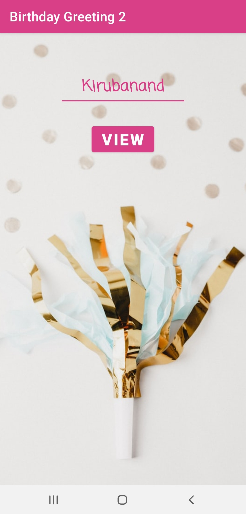

# Birthday-Greeting-2
A simple app using Navigation Components and SafeArgs to get the name of the user and wish him/her "Happy Birthday". This app is an upgradation to another app where I used Intents. 

### Screenshots of the App
<table>
  <tr>
    <td>  </td>
    <td>  </td>
    <td>  </td>
  </tr>
</table>

**_Note:_ You can find the other app that I developed using Intents here :point_right: [Click Here](https://github.com/kiruba-r11/Birthday-Greeting)**
